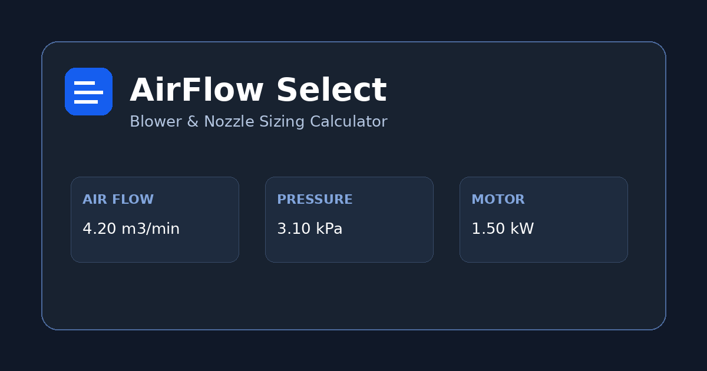

# AirFlow Select — Blower & Nozzle Sizing

도금 연속라인의 Air Blow 공정에서 **다공 홀, 슬롯/장공, 사각, 원형, 사용자 지정 면적 노즐**을 기준으로 필요한 풍속·풍량·풍압·모터 용량을 빠르게 산정하고, 블로워 후보를 비교하며 PDF/PNG 보고서를 출력하는 정적 웹 계산기입니다.

## Preview

첫 화면에서 노즐 형상과 제거 강도를 선택하면 우측에 요구 Duty Point가 즉시 계산됩니다. 보고서 탭에서는 동일한 계산값을 `Technical Blue`, `Mono Print`, `Dark Industrial`, `Compact` 네 가지 스타일로 전환할 수 있습니다.



## Features

- 노즐: 다공 홀 / 슬롯 / 사각 / 원형 / 사용자 지정 면적
- 풍속 기준 또는 노즐 차압 기준 계산
- 제거 강도별 초기 풍속 프리셋(경험적 시작값, 표준 아님)
- 공기 밀도(온도·대기압), Cd, 배관/필터 손실, 풍량/압력 여유, 효율 반영
- 동일 노즐 다수 병렬 사용 시 총 풍량 자동 합산
- 요구 Duty Point: m³/min + kPa(g)
- 축동력 및 권장 표준 모터 프레임 추정
- 사용자 입력 블로워 후보 적합/부족 판정
- 계산식과 가정이 포함된 보고서
- PDF / PNG / JSON / Browser Print 출력
- LocalStorage 자동 저장 + 최근 계산 이력
- URL 상태 공유
- Light / Dark / System Theme
- 모바일·태블릿·데스크톱 반응형
- GitHub Pages Actions 자동 배포

## Calculation Basis

초기 설계용 단순화 모델입니다.

```text
ρ = P / (R · T)
Q = A · V
q = 1/2 · ρ · V²
ΔP_nozzle = 1/2 · ρ · (V/Cd)²
P_blower = (ΔP_nozzle + ΔP_system) · (1 + pressure margin)
Q_blower = Q · (1 + flow margin)
Power_shaft ≈ ΔP · Q / η
```

노즐 형상별 기하 면적은 UI에서 자동 계산합니다. `Cd`는 노즐 수축/손실을 묶은 단순화 계수입니다. 고압·고속 영역에서는 압축성 효과가 커질 수 있으므로 별도 계산 또는 제조사 검증이 필요합니다.

### Engineering references

- Kaeser, *Blowers for air knives*: https://pr.kaeser.com/en/compressed-air-resources/kaeser-talks-shop/blowers-for-air-knives.aspx
- Atlas Copco, *Compressed Air Manual*: https://www.atlascopco.com/content/dam/atlas-copco/local-countries/greece/documents/mechanical-electrical-contractors/Compressed%20Air%20Manual%209th%20edition1.pdf

상세 가정과 단위 정의는 `docs/CALCULATION_BASIS.md`를 참고하세요.

최종 구매 모델은 반드시 **제조사 P–Q 성능곡선에서 요구 풍량과 요구 압력을 동시에 만족하는 운전점**을 확인하세요.

## Tech Stack

HTML5 · CSS3 · JavaScript ES2022 · Browser Canvas/SVG Export · LocalStorage · GitHub Pages

## Project Structure

```text
├─ public/                 favicon, app icons, OG image, manifest, 404, SEO
├─ src/
│  ├─ app.js              calculator / report / history / export logic
│  └─ styles.css          design system + report themes
├─ docs/                   calculation assumptions and equations
├─ .github/workflows/     GitHub Pages deployment
├─ run-github-bootstrap.cmd  Windows safe launcher (recommended)
├─ github-bootstrap.cmd      ASCII-only CMD wrapper
├─ scripts/                 dependency-free build/dev server
└─ README.md
```

## Local Development

```bash
npm install
npm run dev
```

기본 개발 주소는 `http://localhost:5173/`입니다.

## Build

```bash
npm run build
```

모든 asset을 상대 경로(`./`)로 참조하므로 GitHub Pages의 Repository 하위 경로에서도 정상 로드됩니다. 빌드 스크립트는 외부 패키지 없이 `dist/`를 생성합니다.

## GitHub Pages Deployment

### 자동 배포

1. GitHub에 새 Repository를 만듭니다.
2. 전체 프로젝트를 `main` 브랜치에 push 합니다.
3. Repository → **Settings → Pages → Build and deployment**에서 Source가 **GitHub Actions**인지 확인합니다.
4. `.github/workflows/deploy.yml`이 build 후 `dist/`를 Pages에 배포합니다.
5. 이후에는 `git push`만 하면 자동 재배포됩니다.

### Windows 원클릭

`run-github-bootstrap.cmd`를 더블클릭하는 것을 권장합니다. v1.0.4부터 Bootstrap은 사용자가 제공한 검증된 배치 흐름을 기준으로 다시 작성한 ASCII + Windows CRLF 전용 CMD입니다. PowerShell Bootstrap은 사용하지 않습니다. `gh repo view`가 실패하면 이를 오류로 종료하지 않고 저장소가 아직 없는 정상 상황으로 간주하여 `gh repo create`를 실행합니다. Git/GitHub CLI 확인 → 로그인 → repo 확인/생성 → origin 설정 → commit/push → Pages/Actions 확인 → `v1.0.4` tag 생성을 순차 처리합니다. Node.js/npm은 로컬 검증에만 선택적으로 사용하며, 없어도 GitHub Actions가 원격에서 빌드합니다. Token/Password는 스크립트에 저장하지 않습니다.

## Configuration

- 서비스명/기본 입력값/프리셋/계산식: `src/app.js`
- 전체 UI 디자인 토큰: `src/styles.css` 상단 `:root`
- 보고서 디자인: `src/styles.css`의 `.report-technical`, `.report-mono`, `.report-industrial`, `.report-compact`
- SNS/SEO URL: `index.html`, `public/robots.txt`, `public/sitemap.xml`의 `USERNAME` / `REPOSITORY`를 실제 값으로 교체

## Custom Domain

GitHub Pages Settings에서 Custom domain을 등록하고 HTTPS 강제를 활성화하세요. 필요하면 `public/CNAME` 파일에 도메인만 한 줄로 추가할 수 있습니다. 커스텀 도메인을 사용하면 `index.html`의 canonical/OG URL과 `sitemap.xml`도 해당 도메인으로 바꾸세요.

## Safety / Scope

이 도구는 초기 설계 비교용이며 CFD, 제조사 선정 프로그램 또는 현장 성능시험을 대체하지 않습니다. 실제 제거 성능은 노즐 거리·각도·라인 속도·표면 형상·액체 물성·이물 부착력에 따라 달라집니다.

## Repository metadata recommendation

- Description: `Industrial air blower and nozzle sizing calculator with PDF/PNG engineering reports`
- Topics: `engineering`, `blower`, `air-knife`, `calculator`, `vanilla-js`, `static-site`, `github-pages`
- Initial tag: `v1.0.4`
- Initial commit: `feat: launch airflow blower sizing calculator`

## License

MIT
